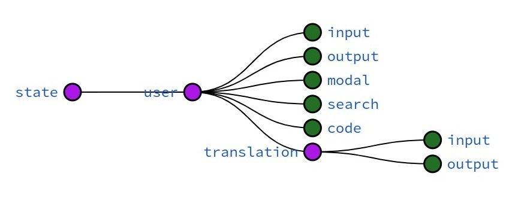

# This project is a Translator App receives input text from a user and translate it from/to the selected languages using public Google Translate API.

# Features

  
<strong>State Management with Redux</strong>
 

