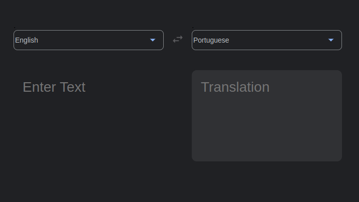
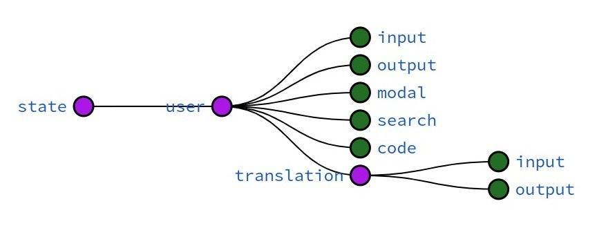

## This project is a Translator App that receives input text from a user and translate it from/to the selected languages using public Google Translate API.

---

## Overview of the App
<details>
  <summary><strong>Image of the Main Screen</strong></summary><br />



</details>

---

# Features

<details>
  <summary><strong>State Management with Redux</strong></summary><br />

  
</details>

<details>
  <summary><strong>Fake API for supported languages</strong></summary><br />
  The response from the GET request for supported languages was always the same, then I saved the JSON a deployed a FAKE API so the rendering could be faster.

  [Fake API For Supported Languages](https://fake-api-beta.vercel.app/data)
</details>

<details>
  <summary><strong>Google Cloud Platform</strong></summary><br />

  01. [Activate API](https://console.cloud.google.com/apis/)
  02. [Install Google CLI to set up Application Default Credentials](https://cloud.google.com/docs/authentication/provide-credentials-adc)
  03. Create credential file on terminal: `gcloud auth application-default login`
  04. Import 'Translate' and 'TranslationServiceClient' from the '@google-cloud/translate' library
  04. Create a translate object
      ```js
      const CREDENTIALS = JSON.parse(process.env.CREDENTIALS)
      const translate = new Translate({
          credentials: CREDENTIALS,
          projectId: CREDENTIALS.project_id
      });
      ```
  05. Translate a text
      ```js
      const translateText = async (text, code) => {
        try {
            let [response] = await translate.translate(text, code);
            return response;
        } catch (error) {
            console.log(`Error at translateText --> ${error}`);
            return 0;
        }
      };
      ```
  
  06. Get supported languages
      ```js
      const supportedLanguages = async() => {
        const client = new TranslationServiceClient();
        const parent = `projects/${CREDENTIALS.project_id}/locations/global`
        const [response] = await client.getSupportedLanguages({ parent });
        const languages = response.languages.map(({languageCode})=> (
          { code: languageCode, language: iso.getName(languageCode)}))
        return languages;
      }
       ```

</details>

<details>
  <summary><strong>Simple and maintainable code</strong></summary><br />
   
  ```js
      import { useSelector } from "react-redux";
      import { Arrows, TextBox, Modal } from "./components";


      const App = () => {
        const modal = useSelector(state => state.user.modal)
        return (
          <div className="app">
            {!modal && (
              <>
              <TextBox style='input'/>
                <Arrows />
              <TextBox style='output'/>
              </>
              )}
            {modal &&<Modal/>}
          </div>
        );
      }

      export default App;
  ```

</details>


---

# Install dependencies and run project
   ```bash
  cd client
  npm install
  npm start
  ```
 ```bash
  cd server
  npm install
  npm run dev
  ```


